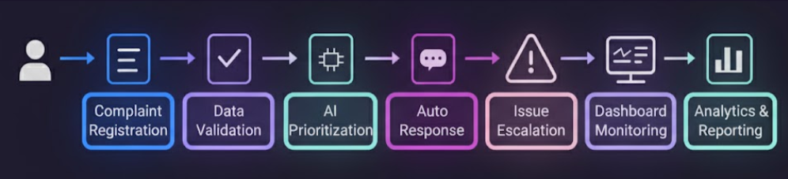
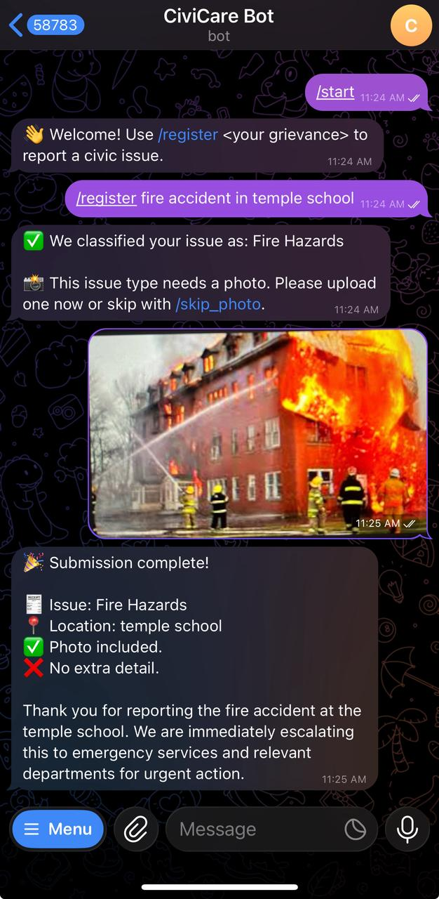

## 🏛️ CiviCare AI – Smart Grievance Redressal Framework


<p align="justify">
  An AI-powered civic grievance management system that automates complaint handling through <b>NLP</b>, <b>sentiment analysis</b>, and <b>Generative AI (Gemini API)</b>.  
  Citizens can instantly report issues via a <b>Telegram chatbot</b> using text, photos, or QR-based access. The system intelligently classifies, prioritizes, and escalates complaints using a dynamic <b>priority index</b>, while all data are stored and reflected on a <b>MySQL–Streamlit dashboard</b> that empowers municipal officers to monitor, act, and resolve citizen grievances efficiently.  
</p>


> ⚡ Empowering smarter, faster, and transparent governance through AI-driven automation.


---
Developed by *Jeeva M & M Vishal*
---
## 🚀 Project Overview
This system automates grievance collection and prioritization for municipal governance using:
- **Telegram Bot** for citizen complaints  
- **Gemini API** for NLP-based issue extraction and polite AI replies  
- **Transformers (BERT)** for sentiment-based priority scoring  
- **MySQL** for structured grievance storage  
- **Streamlit Dashboard** for data analytics, heatmaps, and visualization  

---

## 🧩 System Architecture

Below illustrates the **end-to-end flow** of the Civic Grievance AI system —  
from complaint registration to AI prioritization, escalation, and analytics.

<p align="center">
  
</p>

---

## 📊 Dashboard UI Preview

Below are snapshots from the **Streamlit Civic Grievance Dashboard**, showcasing real-time analytics, prioritization, and escalation workflows.  

### 🔸 Dashboard Overview  
<p align="center">
  
</p>

### 🔸 High Priority Issues Analytics  
<p align="center">
  
</p>

### 🔸 Complaint Detail Cards  
<p align="center">
  
</p>

### 🔸 Department Escalation Notification  
<p align="center">
  
</p>

### 🔸 Monthy Report Generation
<p align="center">
  
</p>

---

✅ **Each dashboard module demonstrates:**
- AI-driven prioritization based on sentiment, severity, and frequency.  
- Real-time grievance filtering (Issue Type, Status, Location).  
- Interactive visualizations built using Plotly + Streamlit.  
- Automated escalation alerts to concerned departments.  
- Dynamic monitoring through heatmaps, charts, and tables.
- Monthy report generated in one-click (pdf/csv)

---

```
## 🧰 Folder Structure
├── 📂 bot  
│ ├── init.py  
│ ├── main.py → Entry point to run Telegram bot  
│ ├── handlers.py → Handles commands, messages, and multi-step submissions  
│ ├── database.py → DB creation, saving, and retrieval functions  
│ ├── priority_index.py → AI-based priority calculation (sentiment + keywords)  
│ ├── genai_helper.py → Gemini API helpers for classification and replies  
│ ├── issue_config.py → Config for 20 civic issue types  
│ ├── dashboard.py → Streamlit dashboard for analytics  
│ └── utils.py → Gemini reply utility  
│  
├── .env → Environment variables  
├── .gitignore → Git ignore configuration  
├── requirements.txt → Python dependencies  
├── README.md → Documentation file  
└── venv/ → Virtual environment  
```
---

## ⚙️ Step 1: Setup Environment
1️⃣ Install Python 3.11+  
2️⃣ Create virtual environment and activate it  
3️⃣ Install dependencies  
4️⃣ Configure .env file

Example .env:
```
TELEGRAM_BOT_TOKEN="8331147973:AAHQ2eGRosrTE3Biu2xifNFwb2BJdOnyRYk"
DB_HOST="localhost"
DB_USER="root"
DB_PASSWORD=<DB PWD>
DB_NAME="grievance_db"
GEMINI_API_KEY=<ENTER API-KEY>
```

---

## 🧠 Step 2: Initialize Database
Start MySQL, then run:
```
python -c "from database import init_db; init_db()"
```

---

## 🤖 Step 3: Run Telegram Bot
```
python main.py
```

✅ The bot will log: “🤖 Bot is running...”  
Then test in Telegram:
```
/start
/register Garbage overflowing near bus stop
```

---

## 📊 Step 4: Launch Streamlit Dashboard
```
streamlit run dashboard.py
```
Open [http://localhost:8501](http://localhost:8501)

---

## 🧩 Key Functionalities
| Feature | Description |
|----------|--------------|
| **AI Issue Detection** | Uses Gemini API to identify issue type and location |
| **AI Polite Replies** | Gemini generates empathetic acknowledgement replies |
| **Priority Indexing** | BERT + keyword severity + frequency weighting |
| **MySQL Integration** | Stores all grievance records with metadata |
| **Streamlit Dashboard** | Displays complaints, charts, and maps dynamically |

---


## 💬 Telegram Bot Demo Flow

This demonstrates the **CiviCare Bot** interaction on Telegram 👇  

<p align="center">
  
</p>

🗣️ The bot automatically:
- Detects the issue type (e.g., *Fire Hazards*)  
- Requests photos or extra details based on configuration  
- Generates AI-based acknowledgments  
- Saves and prioritizes the complaint using NLP & BERT models  

---

## 📱 Quick Access via QR Code

Click the link to access or test the **Telegram Bot** instantly: (Note: Check whether the backend is running)

Open [Telegram Link](https://t.me/civicare_bot)

---


## 💡 Credits
Developed by **M Vishal & Jeeva M**  
Project: *AI-Based Civic Grievance Redressal System with Priority Analytics*


